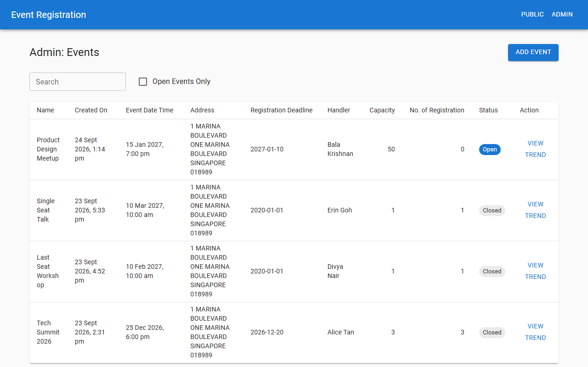
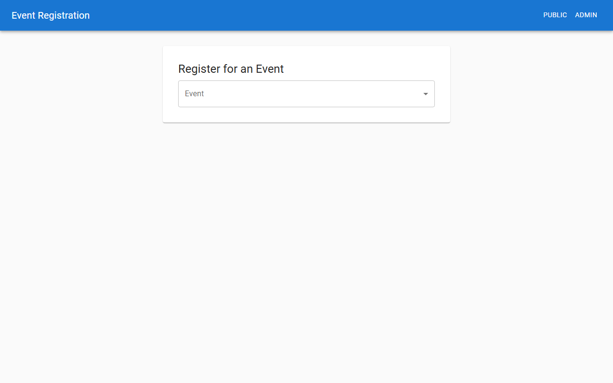

# Event Registration

An events company runs public events with limited seats. Staff create events and assign an employee to run each one; the public registers with an email address. This service keeps two people from taking the last seat at the same moment and shows staff how fast each event is filling.

Backend: Express 5, Sequelize 6, MySQL 8.4, TypeScript. Frontend: React 19, Vite, MUI. API on port 8000, UI on port 8001.

## Prerequisites

- Node 20 or later (24 recommended; see `.nvmrc`).
- Docker Desktop, for the MySQL database.
- A free OneMap account: register at https://www.onemap.gov.sg/apidocs/register. The API refuses to start without OneMap credentials.

## Database setup

1. Copy the environment file.
   - PowerShell: `Copy-Item .env.example .env`
   - bash: `cp .env.example .env`
2. Open `.env` and fill in `ONEMAP_EMAIL` and `ONEMAP_PASSWORD` with your OneMap account.
3. Start the database: `docker compose up -d --wait`

MySQL's first boot can take up to a minute. If the next step reports a lost connection, wait a few seconds and rerun it.

## Seeding

```
cd backend
npm install
npm run db:migrate
npm run db:seed
```

Handlers are the staff who run events. They are not manageable through the system; they are seeded once, with fixed ids. Use these when creating an event by hand:

| Name | uuid |
|---|---|
| Alice Tan | `d39cf190-3b3b-42e1-ba29-aa1675f25a06` |
| Bala Krishnan | `c7260cb9-2e26-49f7-8c54-e62f889930d8` |
| Chen Wei Ming | `c0e08739-c750-4984-90a7-6837d371c838` |
| Divya Nair | `8f8de11b-16d0-4fb3-b9dc-085eae531d6e` |
| Erin Goh | `4aa935bb-8405-4c1c-80e7-109a07b74efb` |

## Running locally

Backend, from `backend/`: `npm run dev`. Listens on port 8000.

Frontend:

```
cd frontend
npm install
npm run dev
```

Listens on port 8001. Open http://localhost:8001 for the public page and http://localhost:8001/admin for the admin page. The UI calls the API at http://localhost:8000; set `VITE_API_URL` in `frontend/.env` to point elsewhere.

Add your first event from the admin page; the tables start empty.

## Running tests

Backend, from `backend/`:
- `npm test`: unit tests, no database needed, coverage threshold 50 percent.
- `npm run test:integration`: needs the Compose database running; covers the concurrency races and the status-code contract. It runs the files one at a time because they share the database.
- `npm run lint`

Frontend, from `frontend/`:
- `npm test`
- `npm run lint`
- `npm run build`

The frontend uses vitest rather than jest because the specification names jest for the backend only.

## API

| Method | Path | Purpose |
|---|---|---|
| GET | `/api/admin/events` | List events for the admin table, with search, open filter, and paging. |
| POST | `/api/admin/events` | Create an event. |
| GET | `/api/admin/handlers` | List handlers for the Add Event form. |
| GET | `/api/public/events` | List open events for the public dropdown. |
| POST | `/api/public/register` | Register an email address for an event. |
| POST | `/api/admin/events/:uuid/trend` | Get the daily registration trend for an event. |

| Status | Meaning |
|---|---|
| 200 | Success. |
| 421 | The request fails validation before anything is looked up: shape, format, ranges, a deadline after the event date (ADR 0002). |
| 400 | The request is valid but fails against stored or external data: unknown ids, duplicate name, postal code not found, handler busy, event closed or full, email already registered (ADR 0002). |
| 500 | Anything unexpected, including any OneMap failure. |

Outside this table: 404 for an unknown route, 503 from `/health`, and 429 only when the rate limiter is enabled.

Every error body is `{ message: string, errors?: Record<string, string[]> }`. See `docs/ARCHITECTURE.md` and `docs/adr/` for field-level rules.

## Assumptions and rules beyond the specification

- One email address may register once per event; testers running repeated registrations must use a distinct address each time (ADR 0006).
- The registration deadline is a Singapore calendar date: send `YYYY-MM-DD` or an ISO date-time, and only the Singapore date is kept (ADR 0003). It may not fall after the event date (ADR 0006).
- Capacity must be a whole number from 1 to 99999 (ADR 0006).
- The event date and the deadline may be at most 100 years ahead (ADR 0006).
- A uuid must be RFC-shaped: a malformed id is 421, a well-formed but unknown id is 400 (ADR 0006).
- `deadline` is echoed as a Singapore calendar date; every other timestamp is echoed as ISO UTC (ADR 0003).
- The `open` query parameter accepts `true` or `1`; any other value, or none, means no filter (ADR 0006).
- The admin events list returns 10 events per page (see `docs/ARCHITECTURE.md`).
- `POST /api/admin/events` returns an empty body on success (ADR 0002).
- `GET /api/admin/handlers` is an extra endpoint, added only so the Add Event form has a handler list to show (ADR 0008).
- The trend button on the admin table is labelled "View Trend"; the specification's sample calls it Trend.
- `/health` is an operations endpoint, not part of the product API (ADR 0010).
- The per-IP rate limiter on `POST /api/public/register` is off unless `RATE_LIMIT_ENABLED=true` is set in `.env`; when on, it allows 10000 requests per minute per IP and returns 429 past that (ADR 0009).
- Past event dates are accepted on creation, so a closed event can be created directly (ADR 0006).
- `trust proxy` is not set because the local setup has no reverse proxy; behind one, set it so the rate limiter keys on the client address (ADR 0009).
- `npm audit` in `backend/` reports one moderate advisory in a transitive `uuid` dependency of Sequelize; there is no upgrade path without changing ORM and the affected function is never called here.

## Screenshots


The admin events table with search, the open-events filter, and paging.


The public page: pick an open event, then register with an email address.

## Repository layout

```
AGENTS.md            conventions, structure, commands
docker-compose.yml    local MySQL
.env.example          environment template
backend/src/
  routes/             thin routers, one service call per route
  services/           business rules and transactions
  models/             Sequelize models and associations
  middleware/         request validation, request logging, error handling
  validation/         zod schemas
  utils/              dates, logging, error types
frontend/src/
  api/                axios client
  pages/              one component per route, with its hook and sub-components
  components/         dialogs, form, validation helper, table, status badge
  utils/              the frontend copy of the "is open" rule, document title hook
docs/adr/             one decision record per non-obvious choice
```

`AGENTS.md` holds the full conventions for anyone working in this repo.

## Licence

MIT
